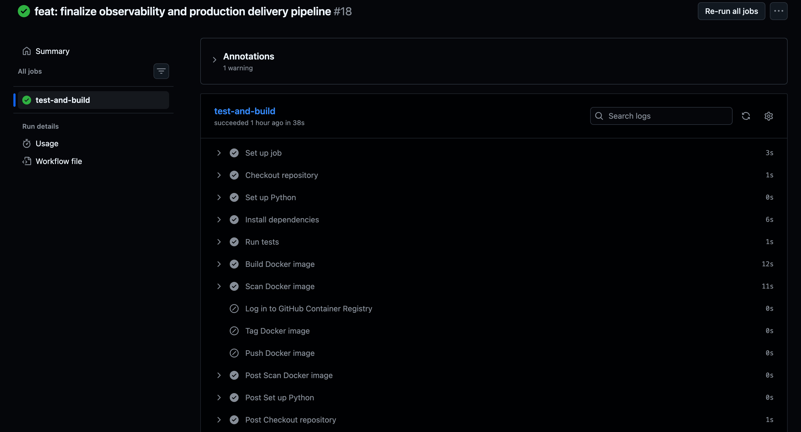
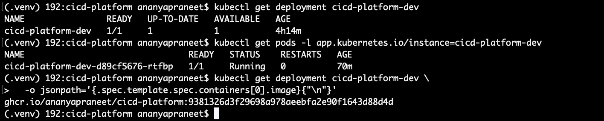
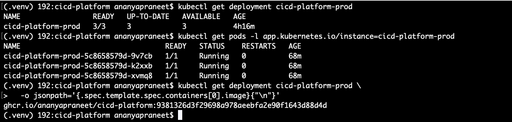
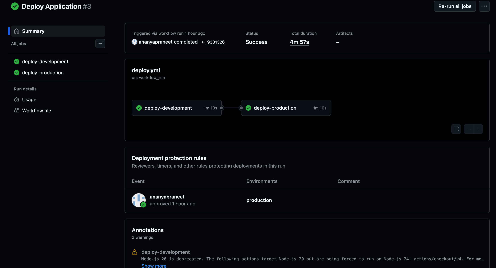
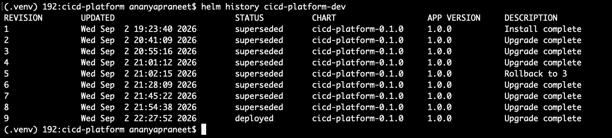

# CI/CD Platform

[](https://github.com/ananyapraneet/cicd-platform/actions/workflows/ci.yml)
[](LICENSE)

A DevOps-focused project demonstrating an end-to-end CI/CD platform for building, testing, securing, publishing, deploying, verifying, promoting, and rolling back a containerized application on Kubernetes.

The application itself is intentionally minimal.

**The delivery platform is the product.**

This project demonstrates practical DevOps and platform-engineering concepts including:

* GitHub Actions CI/CD
* Pull request validation
* Docker containerization
* Non-root containers
* Ruff linting
* Trivy security scanning
* Immutable Docker artifacts
* GitHub Container Registry (GHCR)
* Kubernetes
* kind
* Helm
* Development and production environments
* Automated deployment
* Deployment verification
* Production approval gates
* Self-hosted GitHub Actions runners
* Helm-based rollback
* Git-based traceability

---

## Scope

This project is intentionally demonstrated using a **local Kubernetes cluster created with `kind`**.

The cluster is accessed by a **GitHub Actions self-hosted macOS runner** for deployment jobs, while pull-request CI runs on GitHub-hosted runners.

This approach avoids ongoing cloud infrastructure costs while preserving the core delivery architecture that could be adapted to a managed Kubernetes platform such as Amazon EKS or Google GKE.

The application and Kubernetes environments are **not publicly hosted**.

The objective is to demonstrate the engineering behind the CI/CD platform rather than operate a continuously available public application.

---

# Architecture

The platform separates pull-request validation from post-merge deployment.

## Pull Request Flow

Pull requests run entirely on GitHub-hosted runners.

```text
Developer
    |
    v
Feature Branch
    |
    v
Pull Request
    |
    v
GitHub-hosted Runner
    |
    +--> Tests
    |
    +--> Ruff
    |
    +--> Docker Build
    |
    +--> Trivy Scan
    |
    v
  STOP
```

Pull requests:

* Run automated tests
* Run Ruff linting
* Build the Docker image
* Scan the image with Trivy
* Do not publish the image to GHCR
* Do not deploy to Kubernetes
* Do not use the self-hosted runner

This keeps unmerged changes outside the deployment environment.

---

## Main Branch Flow

After a pull request is merged into `main`, the validated commit enters the delivery pipeline.

```text
Merge to main
    |
    v
GitHub-hosted Runner
    |
    +--> Tests
    |
    +--> Ruff
    |
    +--> Docker Build
    |
    +--> Trivy Scan
    |
    +--> Push Image to GHCR
    |
    v
Self-hosted Runner
    |
    +--> Deploy Development
    |
    +--> Kubernetes Rollout Verification
    |
    +--> Running Image Verification
    |
    +--> Application Health Verification
    |
    v
Production Approval
    |
    v
Deploy Production
    |
    +--> Kubernetes Rollout Verification
    |
    +--> Running Image Verification
    |
    +--> Application Health Verification
```

---

## Immutable Artifact Flow

The project follows a build-once, promote-the-same-artifact model.

```text
Git Commit SHA
      |
      v
Docker Image
      |
      v
Trivy Security Scan
      |
      v
GHCR
      |
      v
Development
      |
      v
Production
```

The Docker image is not rebuilt between environments.

The image is identified using the Git commit SHA:

```text
ghcr.io/ananyapraneet/cicd-platform:<git-sha>
```

This provides traceability between:

```text
Source Code
    |
    v
Git Commit
    |
    v
Docker Image
    |
    v
Kubernetes Deployment
```

---

# Security Boundary

A deliberate security boundary exists between pull-request CI and deployment infrastructure.

## Pull Request CI

Pull-request jobs run on GitHub-hosted runners and perform:

* Tests
* Ruff linting
* Docker image build
* Trivy scanning

They do not access:

* The self-hosted runner
* The local Kubernetes cluster
* Development deployment
* Production deployment

## Deployment

The self-hosted runner is used only by the post-merge deployment workflow.

```text
Pull Request
     |
     v
GitHub-hosted Runner
     |
     +--> Tests
     +--> Ruff
     +--> Docker Build
     +--> Trivy
     |
     v
    STOP
```

After merge:

```text
main
 |
 v
GitHub-hosted Runner
 |
 +--> Tests
 +--> Ruff
 +--> Docker Build
 +--> Trivy
 +--> GHCR
 |
 v
Self-hosted Runner
 |
 +--> kubectl
 +--> Helm
 +--> kind
```

This prevents untrusted pull-request code from being executed directly on the machine that has access to the local Kubernetes cluster.

---

# CI/CD Pipeline

The CI/CD platform is implemented using GitHub Actions.

## Pull Request Pipeline

The pull-request validation path is:

```text
Checkout
    |
    v
Set up Python 3.12
    |
    v
Install Dependencies
    |
    v
Run Tests
    |
    v
Ruff Lint
    |
    v
Build Docker Image
    |
    v
Trivy Security Scan
    |
    v
STOP
```

No image is published from a pull request.

No Kubernetes deployment occurs from a pull request.

---

## Main Branch Pipeline

The `main` branch pipeline is:

```text
Checkout
    |
    v
Set up Python 3.12
    |
    v
Install Dependencies
    |
    v
Run Tests
    |
    v
Ruff Lint
    |
    v
Build Docker Image
    |
    v
Trivy Security Scan
    |
    v
Authenticate with GHCR
    |
    v
Tag Image with Git SHA
    |
    v
Push Image to GHCR
```

The resulting immutable image is then consumed by the deployment workflow.

---

# Pipeline Evidence

The repository includes screenshots demonstrating the CI/CD platform operating through its major delivery and recovery paths.

## CI Pipeline Success

The CI workflow successfully completes the validation pipeline.



---

## Development Deployment After Rollback

The development environment is restored to a known-good deployment after the rollback test.



---

## Production Deployment

The production deployment uses the immutable image promoted through the pipeline.



---

## Production Deployment Success

The production deployment completes successfully after the approval gate.



---

## Helm Rollback History

Helm release history demonstrates the available deployment revisions used for recovery.



---

# Application

The application is intentionally minimal so that the focus remains on the delivery platform.

## `GET /`

Returns:

```json
{
  "message": "CI/CD Platform API"
}
```

## `GET /health`

Returns:

```json
{
  "status": "healthy"
}
```

The `/health` endpoint is used for:

* Docker health checks
* Kubernetes readiness probes
* Kubernetes liveness probes
* Deployment verification

---

# Containerization

The application is containerized using Docker.

The Docker image:

* Uses `python:3.12-slim`
* Runs as a non-root user
* Exposes port `8000`
* Includes a Docker health check
* Sets `PYTHONDONTWRITEBYTECODE=1`
* Sets `PYTHONUNBUFFERED=1`
* Installs dependencies without retaining pip cache

The container runs as:

```text
appuser
```

rather than `root`.

---

# Security Scanning

Docker images are scanned using Trivy before being published to GHCR.

The CI pipeline checks for:

* `HIGH` vulnerabilities
* `CRITICAL` vulnerabilities

The scan is configured with:

```text
exit-code: 1
ignore-unfixed: true
```

This means the pipeline fails when blocking HIGH or CRITICAL findings are detected, while vulnerabilities without an available fix are ignored.

The security sequence is therefore:

```text
Build
  |
  v
Trivy Scan
  |
  v
Push to GHCR
```

The image is not published before the security scan succeeds.

---

# GitHub Container Registry

Docker images are published to GitHub Container Registry (GHCR).

Image format:

```text
ghcr.io/ananyapraneet/cicd-platform:<git-sha>
```

Example:

```text
ghcr.io/ananyapraneet/cicd-platform:fcb3656c56d9dee89393b7328734836c48d3f033
```

GitHub Actions authenticates to GHCR using the GitHub-provided `GITHUB_TOKEN`.

Images are tagged using the Git commit SHA rather than the mutable `latest` tag.

This provides:

* Immutable image identification
* Deployment traceability
* Reproducible artifact references
* Clear deployment history
* Reliable rollback targets

Images are published only from `main`.

---

# Kubernetes

The application is deployed to a local Kubernetes cluster created with `kind`.

Cluster context:

```text
kind-cicd-platform
```

The deployment uses:

* Kubernetes Deployment
* Kubernetes Service
* Rolling updates
* Readiness probes
* Liveness probes
* Environment-specific replica counts

The application exposes port `8000` inside the container.

The Kubernetes Service provides access to the application within the cluster.

---

# Helm

Kubernetes deployment configuration is managed using Helm.

Chart:

```text
helm/cicd-platform
```

The chart contains:

```text
helm/cicd-platform/
├── Chart.yaml
├── values.yaml
├── values-dev.yaml
├── values-prod.yaml
├── .helmignore
└── templates/
    ├── _helpers.tpl
    ├── deployment.yaml
    └── service.yaml
```

The Helm chart manages:

* Kubernetes Deployment
* Kubernetes Service
* Container image
* Replica count
* Image pull policy
* Readiness probe
* Liveness probe
* Resource configuration

Example development deployment:

```bash
helm upgrade --install cicd-platform-dev helm/cicd-platform \
  -f helm/cicd-platform/values.yaml \
  -f helm/cicd-platform/values-dev.yaml \
  --set image.tag=<git-sha>
```

---

# Environment Separation

Development and production use the same Helm chart with environment-specific values.

```text
                    Helm Chart
                        |
              +---------+---------+
              |                   |
              v                   v
       values-dev.yaml     values-prod.yaml
              |                   |
              v                   v
       Development          Production
```

## Development

Release:

```text
cicd-platform-dev
```

Replica count:

```yaml
replicaCount: 1
```

## Production

Release:

```text
cicd-platform-prod
```

Replica count:

```yaml
replicaCount: 3
```

The same Helm templates are reused across environments.

Only environment-specific configuration changes.

The same immutable image SHA is promoted from development to production.

---

# Automated Deployment

Deployment automation is implemented using GitHub Actions and a self-hosted macOS runner.

The self-hosted runner is required because the Kubernetes cluster is a local `kind` cluster running on the development machine.

The deployment workflow listens for successful completion of the `CI` workflow on `main`.

```text
main
 |
 v
CI Workflow
 |
 v
CI Successful
 |
 v
Deployment Workflow
```

The deployment workflow checks out the exact commit that triggered the successful CI workflow:

```text
github.event.workflow_run.head_sha
```

That SHA is passed directly to the deployment script.

This preserves the artifact chain:

```text
CI Commit
    |
    v
GHCR Image
    |
    v
Development
    |
    v
Production
```

---

# Deployment Script

Deployments are automated through:

```text
scripts/deploy.sh
```

Usage:

```bash
./scripts/deploy.sh <dev|prod> <image-tag>
```

Example:

```bash
./scripts/deploy.sh dev fcb3656c56d9dee89393b7328734836c48d3f033
```

The deployment script:

1. Validates the requested environment
2. Selects the corresponding Helm values
3. Deploys the requested image using Helm
4. Waits for Kubernetes rollout completion
5. Displays deployment status
6. Displays the image running in Kubernetes
7. Displays running pods
8. Creates a temporary port-forward
9. Verifies the `/health` endpoint
10. Fails if application health cannot be verified

This provides both Kubernetes-level and application-level deployment verification.

---

# Deployment Verification

Deployment verification occurs at multiple levels.

## Kubernetes Rollout Verification

The deployment waits for the Kubernetes rollout to complete successfully.

```text
Helm Deployment
      |
      v
Kubernetes Rollout
      |
      v
Ready Pods
```

## Running Image Verification

The deployment process displays the image currently running in Kubernetes.

```text
ghcr.io/ananyapraneet/cicd-platform:<git-sha>
```

This confirms that the expected immutable artifact is running.

## Application Health Verification

The deployment verifies:

```text
GET /health
```

Expected response:

```json
{
  "status": "healthy"
}
```

The deployment verification includes retry handling for temporary application startup delays.

A deployment is considered successful only after the Kubernetes rollout and application health verification succeed.

---

# Production Approval Gate

Production deployment is protected using a GitHub Actions `production` environment.

The production deployment:

* Runs only after development deployment succeeds
* Uses the same immutable image SHA deployed to development
* Requires approval through the production environment
* Does not rebuild the Docker image

The promotion flow is:

```text
Development Deployment
        |
        v
Deployment Verification
        |
        v
Production Environment
        |
        v
Manual Approval
        |
        v
Production Deployment
        |
        v
Production Verification
```

This creates a controlled promotion boundary between development and production.

---

# Rollback

Rollback is managed using Helm release history.

View the deployment history:

```bash
helm history cicd-platform-dev
```

Rollback directly with Helm:

```bash
helm rollback cicd-platform-dev <revision>
```

The project also provides:

```text
scripts/rollback.sh
```

Usage:

```bash
./scripts/rollback.sh <dev|prod> <revision>
```

Example:

```bash
./scripts/rollback.sh dev 3
```

The rollback script:

1. Validates the environment
2. Validates the revision
3. Performs the Helm rollback
4. Waits for rollout completion
5. Displays the restored image
6. Displays the running pods

---

## Controlled Rollback Test

Rollback was operationally tested using an intentionally invalid Docker image:

```text
this-image-does-not-exist
```

The resulting Kubernetes deployment entered an image-pull failure state:

```text
ErrImagePull
```

The Helm release was then rolled back to a known-good revision.

```text
Invalid Image
      |
      v
ErrImagePull
      |
      v
Failed Deployment
      |
      v
Helm Rollback
      |
      v
Known-good Revision
      |
      v
Verified Recovery
```

This demonstrates that rollback is not merely configured—it has been tested as an operational recovery path.

---

# Local Quickstart

## Prerequisites

Install:

* Git
* Docker Desktop
* Python 3.12+
* kubectl
* kind
* Helm

Verify the tools:

```bash
git --version
docker --version
python3 --version
kubectl version --client
kind version
helm version
```

---

## Clone the Repository

```bash
git clone https://github.com/ananyapraneet/cicd-platform.git
cd cicd-platform
```

---

## Create the Kubernetes Cluster

```bash
kind create cluster --name cicd-platform --wait 5m
```

Set the Kubernetes context:

```bash
kubectl config use-context kind-cicd-platform
```

Verify:

```bash
kubectl get nodes
```

---

## Deploy Development

The deployment script expects an image that has already been published to GHCR.

Use the Git commit SHA corresponding to an image produced by the CI pipeline.

```bash
./scripts/deploy.sh dev <git-sha>
```

Example:

```bash
./scripts/deploy.sh dev fcb3656c56d9dee89393b7328734836c48d3f033
```

---

## Verify Kubernetes

```bash
kubectl get pods
```

View Helm releases:

```bash
helm list
```

---

## Access the Application

The Kubernetes Service is internal to the cluster, so use port forwarding for local access:

```bash
kubectl port-forward svc/cicd-platform-dev 18000:8000
```

Then:

```bash
curl http://127.0.0.1:18000/
```

Expected:

```json
{
  "message": "CI/CD Platform API"
}
```

Health check:

```bash
curl http://127.0.0.1:18000/health
```

Expected:

```json
{
  "status": "healthy"
}
```

---

## Run Tests Locally

```bash
python -m pytest -v
```

---

## Run Ruff Locally

```bash
ruff check .
```

---

## Roll Back Development

View Helm history:

```bash
helm history cicd-platform-dev
```

Rollback:

```bash
./scripts/rollback.sh dev <revision>
```

---

# Technology Stack

| Technology     | Purpose                          |
| -------------- | -------------------------------- |
| Python 3.12    | Application runtime              |
| FastAPI        | Minimal API                      |
| Pytest         | Automated testing                |
| Ruff           | Python linting                   |
| Git            | Version control                  |
| GitHub         | Repository and collaboration     |
| GitHub Actions | CI/CD automation                 |
| Docker         | Containerization                 |
| Trivy          | Container security scanning      |
| GHCR           | Container image registry         |
| Kubernetes     | Container orchestration          |
| kind           | Local Kubernetes cluster         |
| Helm           | Kubernetes deployment management |
| kubectl        | Kubernetes administration        |
| Bash           | Deployment automation            |

---

# Project Structure

```text
cicd-platform/
├── app/
│   ├── __init__.py
│   └── main.py
│
├── tests/
│   └── test_main.py
│
├── helm/
│   └── cicd-platform/
│       ├── Chart.yaml
│       ├── values.yaml
│       ├── values-dev.yaml
│       ├── values-prod.yaml
│       ├── .helmignore
│       └── templates/
│           ├── _helpers.tpl
│           ├── deployment.yaml
│           └── service.yaml
│
├── scripts/
│   ├── deploy.sh
│   └── rollback.sh
│
├── docs/
│   └── screenshots/
│       ├── ci-pipeline-success.png
│       ├── dev-deployment-post-rollback.png
│       ├── production-deployment.png
│       ├── production-deployment-success.png
│       └── helm-rollback-history.png
│
├── .github/
│   └── workflows/
│       ├── ci.yml
│       └── deploy.yml
│
├── Dockerfile
├── .dockerignore
├── .gitignore
├── requirements.txt
├── LICENSE
└── README.md
```

---

# Git Workflow

The project follows a feature-branch and pull-request workflow.

```text
main
 |
 +-- feature/application
 |
 +-- feature/docker
 |
 +-- feature/ci
 |
 +-- feature/security
 |
 +-- feature/kubernetes
 |
 +-- feature/helm
 |
 +-- feature/deployment
 |
 +-- feature/rollback
```

Typical development flow:

```text
Create Feature Branch
        |
        v
Implement Change
        |
        v
Test Locally
        |
        v
Push Branch
        |
        v
Create Pull Request
        |
        v
GitHub Actions CI
        |
        v
Review
        |
        v
Merge to main
        |
        v
Automated Delivery
```

This keeps `main` stable while making individual platform capabilities independently reviewable.

---

# Testing and Quality

The application contains automated tests covering:

* Root endpoint
* Health endpoint

Run the test suite:

```bash
python -m pytest -v
```

Ruff is used for Python linting:

```bash
ruff check .
```

The final CI quality path is:

```text
Tests
   |
   v
Ruff
   |
   v
Docker Build
   |
   v
Trivy Scan
   |
   v
GHCR
```

This ensures application and container quality checks occur before image publication.

---

# What This Project Demonstrates

This project brings together several DevOps practices into one delivery system.

### Source Control

* Feature branches
* Pull requests
* Pull-request-based main workflow
* Git-based traceability

### Continuous Integration

* Automated tests
* Ruff linting
* Docker builds
* Trivy security scanning

### Artifact Management

* Git SHA-based Docker tags
* GHCR publishing
* Immutable artifact promotion
* Build-once, deploy-many model

### Kubernetes

* kind
* Deployments
* Services
* Health probes
* Rolling updates
* Environment separation

### Helm

* Reusable chart
* Environment-specific values
* Release history
* Rollback

### Continuous Delivery

* Automated development deployment
* Production approval gate
* Production deployment
* Deployment verification

### Operational Recovery

* Deployment failure detection
* Helm revision history
* Controlled rollback
* Recovery verification

### Security

* Non-root Docker container
* Container vulnerability scanning
* Separation of GitHub-hosted and self-hosted runners
* Production approval boundary

---

# Related Portfolio Project

This project focuses primarily on **delivery engineering and platform automation**.

For the complementary application and cloud-infrastructure side of the portfolio, see:

**[Bookify API](https://github.com/ananyapraneet/bookify-api)**

Bookify is a production-style FastAPI/PostgreSQL SaaS backend demonstrating:

* Backend architecture
* REST API design
* Authentication and authorization
* PostgreSQL
* SQLAlchemy
* Alembic
* Redis
* Celery
* Docker
* Terraform
* AWS infrastructure
* Production-oriented backend practices

Together, the projects demonstrate two complementary areas:

```text
Bookify API
Application + Backend + Cloud Infrastructure
                  +
CI/CD Platform
Delivery + DevOps + Platform Engineering
                  |
                  v
          Broader DevOps Portfolio
```

---

# License

This project is licensed under the MIT License.

See [LICENSE](LICENSE) for details.

---

# Project Status

**Completed**

The platform demonstrates the complete delivery lifecycle:

```text
Developer
    |
    v
Pull Request
    |
    v
Tests
    |
    v
Ruff
    |
    v
Docker Build
    |
    v
Trivy Scan
    |
    v
GHCR
    |
    v
Development
    |
    v
Rollout Verification
    |
    v
Image Verification
    |
    v
Health Verification
    |
    v
Production Approval
    |
    v
Production
    |
    v
Rollout Verification
    |
    v
Health Verification
```

And the recovery path:

```text
Deployment Failure
       |
       v
ErrImagePull
       |
       v
Helm History
       |
       v
Known-good Revision
       |
       v
Helm Rollback
       |
       v
Rollout Verification
       |
       v
Healthy Application
```

The application remains intentionally simple so that the engineering focus stays on the **CI/CD, artifact management, security, Kubernetes deployment, environment promotion, verification, and rollback platform**.

